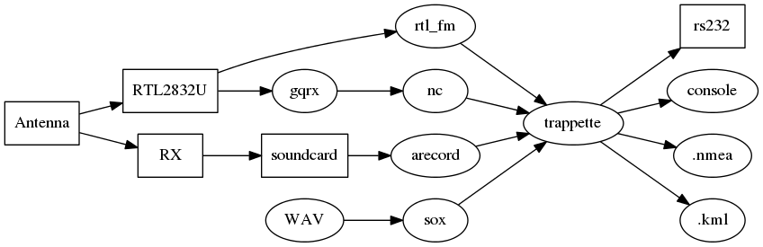

MeteoModem M10 Radiosonde decoding
--

The following source code has been submitted and authorized to diffusion by MeteoModem prior the release  
http://www.meteomodem.com

**/!\ NEVER TRY TO CATCH AN EXPERIMENTAL RADIOSONDE /!\\**

If you find an experimental radiosonde of MeteoModem, Météo-France, CNES, etc... **DON'T TOUCH IT!**  
A team is already on way to recover it.  
If you find one, contact the appropriate department at the telephone number indicated or follow instructions.  

We only display the GPS coordinates, and in no case the temperature! Neither now nor never!  
Indeed we are ham radio and SWL, not professionals. If you need temperature display, you're on the wrong place.

Compilation
--
```
git clone https://github.com/Quadricopter/trappette.git  
cd trappette  
make
```
Operation
--
trappette reads **48kHz/S16LE** raw binary stream from stdin.  
This stream can be generated by arecord, gqrx UDP socket, rtl_fm, sox, etc...  

Usage
--
Copy trappette.cfg.sample file
```
cp trappette.cfg.sample trappette.cfg
```
and edit new trappette.cfg file to specify your QRA settings
```
vi trappette.cfg
```
### Sound card #
```
arecord -f S16_LE -c 1 -r 48k -t raw | ./trappette
```
### gqrx UDP socket #
Enable gqrx UDP ( default port: 7355 ), and grab stream with **nc** (http://gqrx.dk/doc/streaming-audio-over-udp)  
```
nc -l -u 7355 | ./trappette
```
### rtl_fm #
Specify frequency (-f) and ppm correction (-p). Exemple for **402MHz** and **75ppm** correction:  
```
rtl_fm -p 75 -f 402M -M fm -s 48k -E dc - | ./trappette
```
To find your specific ppm correction, run **rtl_test** with -p parameter, and let it run **at least 15 min**!  
```
rtl_test -p
```
Then pick-up your last "cumulative PPM: **XX**" value.  
### Wav file #
```
sox yourfile.wav -b 16 -e signed-integer -c 1 -r 48k -t raw - | ./trappette
```
Options
--
```
Usage: ./trappette [-k kmlfile] [-n nemafile] [-gpsout] [-hex]
                   [-a seconds] [-t seconds]
                   [-q lat:lon[:alt]]
 -k: specifie an .kml output file
 -n: specifie an .nema gps output file
 -gpsout: NEMA output on serial port
 -hex: hexadecimal dump
 -a: abort time ( nothing received at all )
 -t: time out ( after last received position )
 -q: overwrite QRA position
```
Regards,  
Michael
